# Retail Data Pipeline

An end-to-end ELT learning pipeline for an e-commerce business (Olist). 

Shop Database (Postgres) + Merchandising Catalog (Excel) → **Bronze** → **Silver** (+ Quarantine) → **Gold** star schema, all in ClickHouse, one Business Date per run, orchestrated by Airflow.



Airflow runs the daily steps at 00:00 WIB (Asia/Jakarta). The Business Date is still the calendar day of each Order's purchase timestamp as stored ; the schedule's timezone only decides when runs fire.

## Setup

```bash
python -m venv .venv
.venv/Scripts/python -m pip install -e ".[dev]"     # .venv/bin/... on macOS/Linux
docker compose up -d --build
# Wait until http://localhost:8080 responds (Airflow migrates its database on first start), then:
docker compose exec airflow airflow pools set dimensions 1 "Rebuild Gold dimensions one run at a time"
.venv/Scripts/python -m pipeline.seed shop-db
.venv/Scripts/python -m pipeline.seed catalog
```

## Run

- One Business Date: `docker compose exec airflow airflow dags test daily_orders 2017-11-24`
- Without Airflow: `.venv/Scripts/python -m pipeline.run --business-date 2017-11-24 --step all`
- Backfill (run one date first so the tables exist, and unpause the DAG: backfill runs stay queued while it is paused):
  `docker compose exec airflow airflow dags unpause daily_orders`, then
  `docker compose exec airflow airflow backfill create --dag-id daily_orders --from-date 2016-09-03 --to-date 2018-10-17 --max-active-runs 4`
- Watch runs in the Airflow UI: http://localhost:8080
- Check Gold against the source: `.venv/Scripts/python -m pipeline.reconcile --from 2016-09-04 --to 2018-10-17`
- Prove a rerun changes nothing (run it after any backfill finishes; `dags test` ignores the `dimensions` pool):
  ```bash
  HASH="select cityHash64(groupArray(tuple(*))) from (select * from gold.daily_revenue_by_category where business_date = '2017-11-24' order by product_category)"
  docker compose exec warehouse clickhouse-client --user warehouse --password warehouse -q "$HASH"
  docker compose exec airflow airflow dags test daily_orders 2017-11-24
  docker compose exec warehouse clickhouse-client --user warehouse --password warehouse -q "$HASH"   # same value
  ```
- Query the warehouse: `docker compose exec warehouse clickhouse-client --user warehouse --password warehouse`

## Gold star schema

- `gold.fact_order_items`: one row per Order Item, partitioned by Business Date
- `gold.dim_product`: Product with its resolved Product Category
- `gold.dim_date`: calendar
- `gold.daily_revenue_by_category`: view over the star

## Tests

```bash
docker compose up -d shop-db warehouse-test
.venv/Scripts/python -m pytest
```

Tests use the `shop_test` Postgres database and the `warehouse-test` ClickHouse container, and never touch the dev data.
